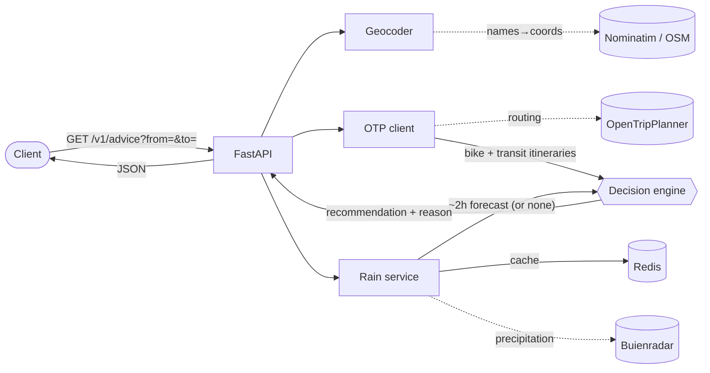

# Fiets of OV

> *"Bike or public transport?"* — for any A→B trip in Amsterdam, get a rain-aware answer in one call.

**Fiets of OV** is a Python/FastAPI service that recommends **cycling** or **public transport** for a trip, based on the short-term rain forecast. It does not route itself — it delegates routing to **[OpenTripPlanner](https://www.opentripplanner.org/)**, overlays **[Buienradar](https://www.buienradar.nl/)** precipitation data, and returns a recommendation with a human-readable reason:

> *"dry during your 24-min ride → bike"* &nbsp;·&nbsp; *"rain around 14:05 → take tram 13"*

[](https://www.python.org/)
[](https://fastapi.tiangolo.com/)
[](https://docs.astral.sh/ruff/)
[](#license)

## How it works

For a trip, the service resolves the endpoints (a place name *or* coordinates), fetches the bike itinerary and the best public-transport itinerary from OpenTripPlanner, overlays the next ~2 hours of rain from Buienradar, and runs a small **pure decision engine** that picks the better option and explains why. Routing is delegated; the value added here is the rain-aware decision layer — and the resilience around the upstreams.



## The endpoint

```
GET /v1/advice?from=<place|lat,lon>&to=<place|lat,lon>
```

`from`/`to` accept **either** a place name (geocoded via Nominatim, bounded to Amsterdam) **or** explicit `lat,lon` coordinates.

```bash
curl "localhost:8000/v1/advice?from=Amsterdam%20Centraal&to=Vondelpark"
```

```json
{
  "recommendation": "bike",
  "reason": "dry during your 24-min ride (rain only from 15:40) → bike",
  "bike_minutes": 24,
  "transit_minutes": 30,
  "max_rain_mm_per_h": 0.0,
  "rain_expected": false,
  "forecast_degraded": false
}
```

`forecast_degraded` is `true` when no rain forecast could be obtained at all: the recommendation still comes back, but it was computed as if the whole trip were dry, so present it with a caveat rather than as a weather-informed answer.

An unroutable trip (OTP answers, but has no itinerary) is a **404** `no route found for this trip`; a genuine routing outage stays a **502** `routing upstream unavailable`.

The decision is driven by **rain, not speed**: a dry ride → bike; rain during the ride → public transport (so you stay dry), falling back to bike-with-a-warning when there's no transit option. See [`app/services/advice.py`](app/services/advice.py).

## Resilience

One flaky upstream must never take down a recommendation:

- **Caching** — the Buienradar forecast is cached in Redis (≈5 min fresh window, served without re-hitting the API; 2 h retention for fallback).
- **Graceful degradation** — if Buienradar is unavailable, the service serves a recent **stale** forecast if it has one; otherwise it returns a bike-first answer with the forecast flagged as unknown (`rain_expected` / `max_rain_mm_per_h` are `null`, and `forecast_degraded` is `true`) — never a 502.
- **At-least-once alerts** — a rain notification is written to the `notifications` outbox before it is sent, and `delivered_at` is stamped only once the channel accepts it; the worker retries undelivered rows on each tick, so a transient outage costs a few minutes rather than the warning.
- **Fail-open cache** — Redis is an optimisation, not a dependency: if it's down or slow (bounded by a socket timeout), the request still runs.
- **Bounded everything** — every external call (OTP, Buienradar, Nominatim, Redis) has an explicit timeout.

## Quick start

```bash
cp .env.example .env                  # config defaults; edit if needed
python3.12 -m venv .venv && . .venv/bin/activate
pip install -e ".[dev]"
uvicorn app.main:app --reload         # http://localhost:8000
```

```bash
curl localhost:8000/health            # {"status":"ok"}
```

> Live routing needs a reachable OpenTripPlanner at `OTP_BASE_URL`. There's no usable public OTP for Amsterdam, so run the **self-hosted OTP overlay** — see [`otp/README.md`](otp/README.md) (`docker compose -f docker-compose.yml -f docker-compose.otp.yml up`). Redis is optional in dev: without it the cache simply fails open.

## Configuration

All config comes from `.env` (see [`.env.example`](.env.example)); never commit `.env`.

| Variable | Default | Purpose |
| --- | --- | --- |
| `APP_ENV` | `dev` | `dev`/`test` allow the placeholder `JWT_SECRET`; any other value refuses to start without a real one |
| `JWT_SECRET` | dev placeholder | Signs access tokens — **must** be ≥32 random bytes outside dev/test (`openssl rand -hex 32`) |
| `CORS_ALLOW_ORIGINS` | `http://localhost:5173` | Comma-separated browser origin allowlist; `*` is rejected |
| `OTP_BASE_URL` | `http://localhost:8080` | OTP2 host root (client appends the GTFS GraphQL path) |
| `BUIENRADAR_URL` | `…/data/raintext` | Buienradar precipitation feed |
| `NOMINATIM_URL` | `…/search` | Forward geocoder for place names |
| `GEOCODER_USER_AGENT` | `fiets-of-ov/0.1 …` | Identifying UA — **required** by Nominatim's usage policy |
| `REDIS_URL` | `redis://localhost:6379/0` | Forecast cache (fail-open) |
| `REQUEST_TIMEOUT_SECONDS` | `10` | Ceiling for every external HTTP call |
| `REDIS_TIMEOUT_SECONDS` | `2` | Redis socket/connect timeout |

## Development

```bash
pytest                          # run the tests (fully offline; respx mocks the upstreams)
ruff check . && ruff format .   # lint, then auto-format
```

## Tech stack

Python 3.12 · FastAPI + Uvicorn · Pydantic v2 · httpx (async) · Redis · pytest + respx · Ruff.

## Attribution

- Rain data © **[Buienradar](https://www.buienradar.nl/)**.
- Routing via **[OpenTripPlanner](https://www.opentripplanner.org/)**.
- Geocoding © **[OpenStreetMap](https://www.openstreetmap.org/copyright)** contributors, via **[Nominatim](https://nominatim.org/)**.

## License

Released under the **MIT License**.
