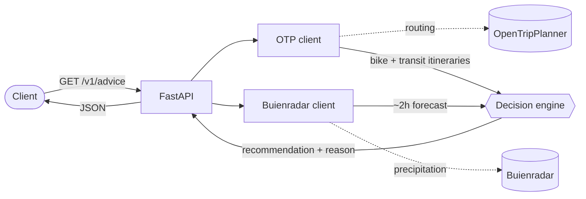

# Fiets of OV

> *"Bike or public transport?"* — for any A→B trip in Amsterdam, get a rain-aware answer in one call.

**Fiets of OV** is a Python/FastAPI service that recommends **cycling** or **public transport** for a trip, based on the short-term rain forecast. It does not route itself — it delegates routing to **[OpenTripPlanner](https://www.opentripplanner.org/)**, overlays **[Buienradar](https://www.buienradar.nl/)** precipitation data, and returns a recommendation with a human-readable reason:

> *"dry until 14:25 → bike"* &nbsp;·&nbsp; *"rain in 15 min → tram 13 in 4 min"*

[](https://www.python.org/)
[](https://fastapi.tiangolo.com/)
[](https://docs.astral.sh/ruff/)
[](#license)

## How it works

For a trip, the service fetches the bike itinerary and the best public-transport itinerary from OpenTripPlanner, overlays the next ~2 hours of rain from Buienradar, and runs a small decision engine that picks the better option and explains why. Routing is delegated; the value added here is the rain-aware decision layer on top.



## Quick start

```bash
cp .env.example .env                  # config defaults; edit if needed
python3.12 -m venv .venv && . .venv/bin/activate
pip install -e ".[dev]"
uvicorn app.main:app --reload         # http://localhost:8000
```

```bash
curl localhost:8000/health            # {"status":"ok"}
```

## Development

```bash
pytest                          # run the tests
ruff check . && ruff format .   # lint, then auto-format
```

## Tech stack

Python 3.12 · FastAPI + Uvicorn · Pydantic v2 · httpx (async) · pytest + respx · Ruff.

## Attribution

- Rain data © **[Buienradar](https://www.buienradar.nl/)**.
- Routing via **[OpenTripPlanner](https://www.opentripplanner.org/)**.

## License

Released under the **MIT License**.
